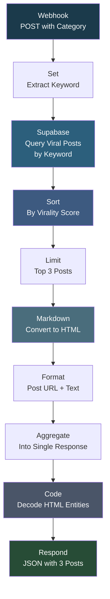

# LinkedIn Fetch 3 Viral Posts from DB

## Overview

This workflow serves as an API endpoint that returns the top 3 viral LinkedIn posts for a given category from a Supabase database. A front-end application sends a POST request with a category keyword, and the workflow queries the viral posts table, sorts by virality score, picks the top 3, formats the content (converting markdown to HTML and decoding HTML entities), and returns the results as a JSON response. It powers the "viral post samples" feature in a LinkedIn content generation UI.

## How It Works

```
Webhook (POST with category + topic) -> Extract keyword -> Query Supabase viral_posts_new table by keyword -> Sort by virality_score descending -> Limit to 3 -> Convert markdown to HTML -> Format post URL + text -> Aggregate into single response -> Decode HTML entities -> Return JSON response
```

### Workflow Diagram



## Integrations

- **Supabase** - Viral posts database (viral_posts_new table)

## Setup

1. Import `Linkedin_Fetch_3_Viral_Posts_from_DB.json` into your n8n instance.
2. Configure Supabase credentials.
3. Ensure the `viral_posts_new` table exists with columns: keyword, data, post_url, virality_score.
4. Activate the workflow. The webhook URL can be called from your front-end application.
